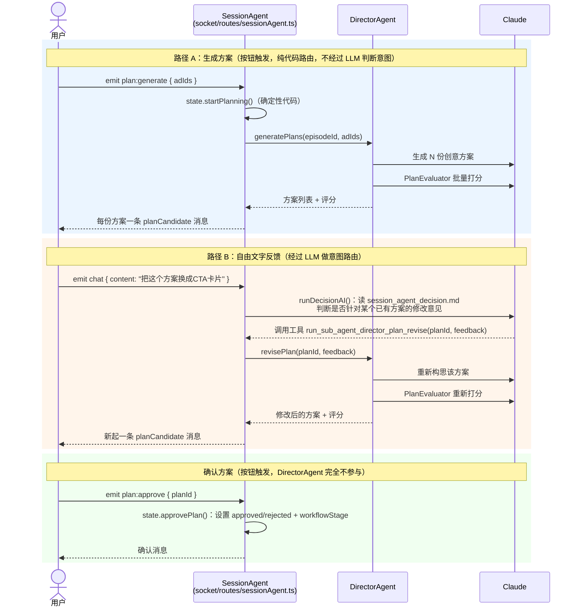

# M2 — SessionAgent & DirectorAgent

状态:**完成，端到端验证通过**
对应设计文档:《广告桥接 Agent 架构设计》v0.4、《开发 Work Plan》v0.2
对应计划:`/Users/zhaoyi/.claude/plans/wiggly-jumping-cosmos.md`（M2 版本）

## 这个里程碑交付了什么

M1 产出了"看懂了什么"（`episodeAnalysis`/`ads[]`），M2 把它变成"接下来怎么办"：

- **DirectorAgent**：纯创意构思，不做调度。输入 episodeAnalysis + 候选广告，一次批量调用生成 N 份跨形式创意方案（`ab_creativePlan`），再批量调用 PlanEvaluator 打分（叙事衔接可行性 / 形式选择合理性 / 广告匹配度）。支持根据用户自由文字反馈原地修改方案。
- **SessionAgent**：Socket.IO 单一会话入口，驱动确定性状态机 `uploaded → plan_review → content_review → assembling`。结构化操作（生成方案、确认方案）是纯代码路由，完全不经过 LLM；只有自由文字反馈才交给 LLM 判断"这句话是不是针对某个方案的修改意见，该转给谁"。

M2 的边界和 M1 一样是设计上明确划的：**方案环节走通即可，不触发任何实际内容生成**（桥接视频/小游戏/CTA 卡片渲染是 M3 的事，BridgeVideoAgent/PlayableAgent/OverlayAgent 现在还不存在，M2 也没有为它们写任何占位工具）。

## 用户交互流程

DirectorAgent 自己不和用户交互——它是两个纯函数（`generatePlans`/`revisePlan`），完全不知道 socket、不知道用户存在。所有用户输入都先经过 SessionAgent，再由它决定要不要转给 DirectorAgent。三条路径：



容易搞混的一点：一次 revise 实际上串了**两层 LLM 调用**——SessionAgent 那次只做"意图路由"（该不该调 revise 工具、调哪个 planId），不产出任何创意内容；DirectorAgent 内部自己还会再调用 Claude 两次（构思 + 评分），这才是真正的创意工作。

## 新增文件

```
src/agents/directorAgent/
  schema.ts                                planDraftSchema / planGenerationSchema /
                                            planEvaluationSchema（Zod）
  prompt.ts                                创意总监 system prompt + 生成/评估/revise 三套消息构建
  index.ts                                 generatePlans(episodeId, adIds) / revisePlan(planId, feedback)

src/agents/sessionAgent/
  state.ts                                 确定性状态机：startPlanning / approvePlan（纯代码，无 LLM）
  index.ts                                 runDecisionAI(ctx)：chat 的 LLM 意图路由循环，
                                            唯一工具 run_sub_agent_director_plan_revise

data/skills/
  session_agent_decision.md                SessionAgent 的路由决策 system prompt（新写，非从 Toonflow 抄）

src/socket/routes/sessionAgent.ts          Socket 命名空间 /api/socket/sessionAgent：
                                            plan:generate / plan:approve（确定性）+ chat / stop（LLM）

scripts/smoketest/
  directorAgent.ts                         直接调用 generatePlans/revisePlan，不经 socket
  sessionAgentState.ts                     直接调用 state.ts，验证状态机转移和守卫
  sessionAgentSocket.ts                    第一个真正的 socket 客户端 smoketest（用 socket.io-client）
```

## 修改的既有文件

| 文件 | 改动 |
|---|---|
| `src/lib/fixDB.ts` | 新增 `ab_episode.workflowStage` 列（`uploaded\|plan_review\|content_review\|assembling`）+ 一次性回填已有行为 `uploaded`。这是和 `ab_episode.status`（StoryboardAgent 的分析流水线状态）完全独立的另一个轴 |
| `src/socket/chatMessagesData.d.ts` | 新增 `planCandidate` 内容类型（DirectorAgent 产出的方案候选卡片），加入 `AIMessageContent` 联合类型。`storyboardCut`/`videoCandidate`/`supervisorResult` 属于 M3/M4，这次没加 |
| `src/socket/resTool.ts` | 新增 `MessageBuilder.planCandidate()`，一次性 `content:add`，写法照抄 `.image()` |
| `src/socket/index.ts` | `routes` 注册表从空对象变成 `{ sessionAgent }`，M0 就留好的"往这个对象里加条目即可"这次真的加上了 |
| `package.json` | 新增 `socket.io-client` devDependency，写 socket 客户端 smoketest 要用 |

## 几个关键设计取舍

1. **广告和 Episode 的关联不落库**——`ab_ad` 依然没有 `episodeId` 外键（M1 的设计决定延续）。用户在发起 `plan:generate` 时临时传一个 `adIds: number[]`，唯一留下的痕迹是每份生成方案自己的 `adId` 字段。
2. **方案生成走 Socket 而不是 REST**——和 M1 的 REST 约定不一样，这是有意为之：SessionAgent 是"唯一的 Socket chat 入口"，方案候选卡片需要作为聊天消息渲染出来，REST 路由做不到这件事。但 `directorAgent.generatePlans()` 本身还是一个纯函数，不依赖 socket，所以 smoketest 照样能绕过 socket 直接调用。
3. **PlanEvaluator 的三个子分不落库**——只有 `overallScore` 写进 `ab_creativePlan.planEvaluatorScore`，子分和点评只在 socket 消息里临时传一次。判断依据：M2 的方案评审是短平快的一轮对话，DB 行 + 聊天消息流已经够用，真需要断线重连后还能看到子分再加列。
4. **revise 原地覆盖，不做版本历史**——同一个 `ab_creativePlan.id`，`status` 重置回 `draft` 逼用户重新确认。聊天消息流本身就是事实上的修改历史。
5. **`content_review` 之后没有"退回"路径**——M2 只做到"确认方案"为止，退回机制等 M3 把 content_review 阶段的具体交互设计出来后再看要不要加。
6. **SessionAgent 没有接 RAG 记忆系统**——Toonflow 的 `Memory` 类是给长篇小说这种跨会话对话设计的，M2 这种"方案评审"是短平快的有界对话，`ab_creativePlan` 行 + 聊天消息流本身已经是完整状态，暂时不接。

## 验证记录

全部真实跑过，三个 Claude smoke test 都是真实 API 调用，不是 mock：

| 验证项 | 方式 | 结果 |
|---|---|---|
| DirectorAgent 生成 + 评估 + revise | `scripts/smoketest/directorAgent.ts`，复用 M1 已分析好的 episode/ads | 通过。3 条候选广告各生成一份方案，评分都在 0-100 范围内，`formatSequence` 可解析；对第一份方案 revise 后同一行 id、`narrative` 有变化、`status` 重置为 `draft` |
| SessionAgent 状态机 | `scripts/smoketest/sessionAgentState.ts`，不经 socket | 通过。`startPlanning` → `plan_review`；`approvePlan` → 目标方案 `approved`、同集其他方案 `rejected`、episode → `content_review`；离开 `plan_review` 后再次 `approvePlan` 正确抛错 |
| Socket 全链路（首次真实客户端连接） | `scripts/smoketest/sessionAgentSocket.ts`，`socket.io-client` 连接真实跑起来的 dev server | 通过。`plan:generate` 收到 2 张 `planCandidate` 卡片；发送自由文字"请把方案 id=6 换成纯 CTA 卡片"，LLM 正确识别出目标 planId 并调用 revise 工具，收到更新后的卡片；`plan:approve` 后 DB 里 `workflowStage` 变成 `content_review` |
| 数据库迁移幂等性 | 重启 dev server 两次 | 通过，`workflowStage` 列 + 回填不报错，`src/types/database.d.ts` 正确拾取新列 |

有一个和这次里程碑无关但顺手处理的插曲：启动时发现端口 10588 被一个残留进程占用——是项目改名前（`ad-bridge-agent` → `contextual-ad-agent`）遗留的旧 dev server，指向已经不存在的旧路径，判断为无害孤儿进程后清理掉，重新正常启动。

## 已知限制 / 留给后续里程碑

- SessionAgent 的工具集这次只有 `run_sub_agent_director_plan_revise` 一个——`run_sub_agent_bridge_video_*`/`_playable_*`/`_overlay_*`/`run_supervision_agent` 等架构文档里提到的工具，等 M3/M4 对应的 Agent 真正存在后再加，这次没有写任何占位/stub。
- `planCandidate` 卡片的 `adName` 字段目前是可选的，SessionAgent 侧还没有从 `ab_ad` 查出广告名称一起带上，前端目前只能拿到 `adId`。
- 模型 key 依然是字面量字符串 `"anthropic:claude-opus-4-8"`，`o_agentDeploy` 的正式部署配置这次也还没有真正启用（CLAUDE.md 里原本说"等 SessionAgent/DirectorAgent 设计出来再弄"，这次评估后决定继续推迟——真正的 Agent key 分类体系是一个独立的配置管理功能，不是这两个 Agent 本身逻辑的一部分，留给后面单独做）。

## 如何自己跑一遍

```bash
cd /Users/zhaoyi/novvy/contextual-ad-agent
yarn dev   # 或已经在跑的话跳过

npx tsx scripts/smoketest/directorAgent.ts       # 会真实调用 Claude，跑两次（生成+评估、revise+评估）
npx tsx scripts/smoketest/sessionAgentState.ts   # 会真实调用 Claude（内部走 generatePlans）
npx tsx scripts/smoketest/sessionAgentSocket.ts  # 需要 dev server 已经在跑，会真实调用 Claude 两次
```

依赖 M1 里已经跑过 `storyboardAgent`/`adLibraryAgent` smoketest 留下的 analyzed episode（id=1）和 ads（id=1/2/3），没有的话先跑一遍 M1 的 smoketest。

## 补记（M3 之后，规划 M4 时的范围调整）

M2/M3 原本的设计允许一份创意方案的 `formatSequence` 是跨形式组合（如 `["video","ctaCard"]`），M3 的三个执行 Agent 和 SessionAgent 的并行派发也是照这个假设写的。规划 M4（Assembler）时明确了产品范围：**一份方案只对应桥接视频 / H5 小游戏 / CTA 卡片三种形式之一，不做组合**——用户是在这轮对话里明确拍板的，理由是先把单一形式的完整链路做扎实，组合脚本以后真需要再开。

改动很小，只动了 DirectorAgent：
- `planDraftSchema` 的 `formatSequence: string[]`（数组）改成 `format: "video"|"playableGame"|"ctaCard"`（单值）——这是从 LLM 输出的 schema 层面结构性排除组合的可能，不是靠约定。
- DB 列和下游（`ab_creativePlan.formatSequence`、SessionAgent 的 `createBridgeCuts()`、socket 协议里 `planCandidate.formatSequence`）**都没有改**——`rowFromPlanAndEvaluation()` 只是把单一 `format` 包成长度为 1 的数组再存进那个列。这样 M3 已经上线的代码（按数组遍历建 `ab_bridgeCut` 行）完全不用动，且长度为 1 的数组遍历出来自然就是"一份方案一个 cut"，行为正好符合新范围。
- 以后如果要重新支持组合，理论上只需要把 `planDraftSchema.format` 放宽回数组即可，下游不用跟着改。

这个决定也让 M3 文档（`docs/milestones/M3.md`）和架构文档里"混合形式序列的执行顺序（并行/按序）"这个悬而未决的问题自然消失了——因为组合本身不存在了。
